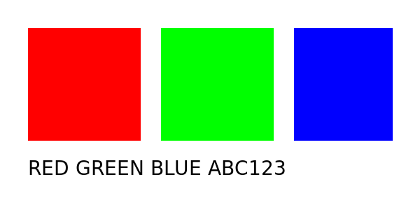

# 网关模型视觉能力实测报告

- **测试日期**：2026-09-03（本地 CST / UTC+8）
- **测试网关**：`http://172.16.113.29:14000`（LiteLLM 代理）
- **测试接口**：OpenAI 兼容 `POST /v1/chat/completions`，`content` 字段携带 `image_url`（base64 编码 PNG）
- **鉴权**：`.env` 中的 `CUSTOM_API_KEY`（虚拟 key，仅放行 `llm_api_routes`，因此 `/v1/model/info` 等能力元数据接口不可用，**图片能力只能靠实测**）

---

## 1. 测试方法

### 1.1 为什么用"带精确文本"的测试图

纯色块测试不足以区分"真看见"和"猜对了"。一张红绿蓝三色块的图，一个纯文本模型也可能说"左边红、中间绿、右边蓝"——因为它可以猜（RGB 是最常见的三色组合，或从提示词反推）。

所以测试图底部放了一行**与颜色无任何推断关联的随机字符串** `ABC123`：

> 模型若能原样读出 `ABC123`，说明它真的接收并解析了图片像素，而不是从常识猜。这是判断"真读图"的关键判据。

### 1.2 测试图

**测试图（`docs/assets/gateway-vision-test-image.png`）：**



- **尺寸**：600 × 300
- **内容**：左侧红色方块（`#FF0000`）、中间绿色方块（`#00FF00`）、右侧蓝色方块（`#0000FF`），底部黑色文本 `RED GREEN BLUE ABC123`
- **生成**：ImageMagick `convert`，已用像素值抽样验证（`pixel(120,120)=srgb(255,0,0)`），并人工目检确认

### 1.3 请求构造

```json
{
  "model": "<模型ID>",
  "messages": [{
    "role": "user",
    "content": [
      {"type": "text", "text": "描述图片。列出三个方块从左到右的颜色和下方的精确文本。格式：COLORS: ..., TEXT: ..."},
      {"type": "image_url", "image_url": {"url": "data:image/png;base64,<...>"}}
    ]
  }],
  "max_tokens": 600
}
```

### 1.4 判定标准

每次测试记录四个布尔量：`r / g / b`（是否说到红/绿/蓝）+ `abc`（是否读出 `ABC123`）。

| 判定 | 条件 |
|---|---|
| ✅ 真读图 | 同时满足 `r & g & b & abc`，且**多次运行稳定** |
| ⚠️ 看但不稳 | 能描述图像内容/形状，但**读不出精确文本**，或结果时好时坏 |
| ❌ 纯文本 | 网关拒收图片内容，或模型自称"看不到图片" |
| ⏱ 未测出 | 被时段配额 / 失效凭证卡住，**与视觉能力无关** |

---

## 2. 完整结果矩阵

全量清单来自 `GET /v1/models`，共 26 个模型。逐模型实测结果如下：

| 模型 ID | 输入是否报错 | 真读图准确性 | 结论 |
|---|---|---|---|
| **claude-opus-4-6** | 成功 | r/g/b/abc 全对，稳定 | ✅ 真读图 |
| **claude-opus-4-7** | 成功 | r/g/b/abc 全对，稳定 | ✅ 真读图 |
| **claude-opus-4-8** | 成功 | r/g/b/abc 全对，稳定 | ✅ 真读图 |
| **claude-opus-5** | 成功 | r/g/b/abc 全对，稳定 | ✅ 真读图 |
| **claude-sonnet-4-6** | 成功 | r/g/b/abc 全对，稳定 | ✅ 真读图 |
| **kimi-k2.6** | 成功 | r/g/b/abc 全对，5/5 稳定 | ✅ 真读图 |
| **gemini-2.5-pro** | 成功 | r/g/b/abc 全对 | ✅ 真读图 |
| **gemini-3-flash-preview** | 成功 | r/g/b/abc 全对 | ✅ 真读图 |
| **glm-5.3-flash** | 成功 | r/g/b/abc 全对，5/5 稳定 | ✅ 真读图 |
| **gpt-4.1** | 成功 | r/g/b/abc 全对，稳定 | ✅ 真读图 |
| **gpt-5.2** | 成功 | r/g/b/abc 全对，稳定 | ✅ 真读图 |
| **gpt-5.4** | 成功 | r/g/b/abc 全对，稳定 | ✅ 真读图 |
| **gpt-5.5** | 成功 | r/g/b/abc 全对，稳定 | ✅ 真读图 |
| **gpt-5.4-mini** | 成功 | r/g/b/abc 全对，稳定 | ✅ 真读图 |
| **gemini-3.1-pro-preview** | 成功 | **0/5 全对**，能描述形状但**读不出精确文本** | ⚠️ 看但不稳 |
| **deepseek-v4-pro** | 成功 | **0/5 全对**，5/5 自称"看不到图片" | ❌ 纯文本 |
| **deepseek-v4-flash** | 成功 | 自称"无法看到图片" | ❌ 纯文本 |
| **deepseek-v4-flash-0731** | 成功 | 0/5 全对，大部分空/否答 | ❌ 纯文本 |
| **deepseek-v4-pro-0813** | **报错** | `Invalid content type. image_url is only supported by certain models.` | ❌ 纯文本（网关拒收） |
| **glm-5.1** | **报错** | `type 参数非法，取值范围 ['text']` | ❌ 纯文本（网关拒收） |
| **glm-5.2** | **报错** | `type 参数非法，取值范围 ['text']` | ❌ 纯文本（网关拒收） |
| **glm-5.3** | **报错** | `type 参数非法，取值范围 ['text']` | ❌ 纯文本（网关拒收） |
| **glm-5.3-night** | **报错** | `type 参数非法，取值范围 ['text']` | ❌ 纯文本（网关拒收） |
| **deepseek-v4-flash-0731-night** | **报错** | 时段配额：`access only allowed during mon,tue,wed,thu,fri 00:00–07:00` | ⏱ 未测出 |
| **glm-5.1-night** | **报错** | 时段配额：`access only allowed during mon,tue,wed,thu,fri 00:00–07:00` | ⏱ 未测出 |
| **glm-5.2-night** | **报错** | `Invalid token`（上游凭证失效） | ⏱ 未测出 |

---

## 3. 关键发现

### 3.1 "支持图片输入"对多数前沿模型是真的

图片输入的 `image_url` 请求能够成功发起，模型也确实**看到并解析了像素**。证据是 `ABC123` 这段无推断关联的随机串被原样读出——这不可能靠常识猜中。

稳定读图且有代表性的模型包括：**Claude 全系（opus-4-6/4-7/4-8/5、sonnet-4-6）、GPT 全系（4.1/5.2/5.4/5.5/5.4-mini）、Gemini 2.5-pro / 3-flash、Kimi K2.6、GLM 5.3-flash**。

### 3.2 `deepseek-v4` 全系和 `glm-5.1/5.2/5.3` 本体是纯文本

这是最重要的结论：

- **`deepseek-v4-pro / v4-flash / v4-flash-0731 / v4-pro-0813`**：要么网关直接拒收图片（`image_url is only supported by certain models.`），要么模型自称"无法看到图片"。
- **`glm-5.1 / glm-5.2 / glm-5.3 / glm-5.3-night`**：网关在请求层就拒绝——`type 参数非法，取值范围 ['text']`。这些模型的 `content` 字段只接受 `text` 类型。
- **⚠️ 重点：`deepseek-v4-flash` 是本 bench 的主力模型，但它不支持图片输入。**

### 3.3 一个必须注意的坑：`glm` 家族的 "-flash" 和本体行为不一致

| 模型 | 图片能力 |
|---|---|
| `glm-5.3` | ❌ 纯文本 |
| `glm-5.3-flash` | ✅ 真读图（5/5 稳定） |

`glm-5.3` 本体是纯文本，但 `glm-5.3-flash` 却是多模态。**不要按家族推断，必须按具体型号实测。**

### 3.4 `deepseek-v4-pro` 是"伪读图"（幻觉示例）

单次测试时它说过"COLORS: red, green, blue, TEXT: Don't be a square"。这看起来像读懂了，但：

- 颜色对（可猜），文本 `Don't be a square` 是**编造的**——测试图上根本没有这行字。
- 5 次重复测试中，它 5/5 自称"看不到图片"（`I don't see an image attached`）。

结论：`deepseek-v4-pro` **实际是纯文本模型**，偶尔能靠猜/上下文给出看似合理的颜色，但一旦要求精确文本就露馅（编造）。**这正是"单次测试判断视觉能力"的危险之处——会把幻觉误判为"真读图"。**

### 3.5 `gemini-3.1-pro-preview` 能看图但汇报不稳定

- 0/5 次全对（从没读出 `ABC123`）。
- 但 0/5 次说"看不到图片"——它总是能描述出"三个方块、有文本"这样的图像结构。
- 有时能列出红/绿/蓝，但文本缺失或残缺（如 `TEXT: RED GREEN`）。

判定：**它确实能看到图片（多模态），但精确输出不可靠**。若作为 judge 或需要精确结构输出的场景，会有风险。

### 3.6 `-night` 后缀模型并非能力差异

`deepseek-v4-flash-0731-night` 和 `glm-5.1-night` 报的是**时段配额**：

```
access only allowed during mon,tue,wed,thu,fri 00:00–07:00; sat,sun 00:00–23:59 (Asia/Shanghai)
```

当前测试时间（周四 19:22）在工作日白天，**超出配额时段**，被限流。这是 **API 服务本身的时段策略**，与视觉能力无关。`glm-5.2-night` 则是上游 token 失效（`Invalid token`）。这三个模型本次**未能测出**图片能力，需要换到配额时间段或修复凭证后再测。

---

## 4. 对 bench 使用的影响与建议

1. **如果你的任务依赖视觉（截图 OCR、界面元素识别、图标理解等）：**
   - 优先使用 **Claude 4.x / 5 系、GPT-4.1 / 5.x、Gemini 2.5-pro / 3-flash、Kimi K2.6、glm-5.3-flash**。
   - 这些模型已被证明能稳定读取精确文本，可用于需要视觉理解的任务。

2. **`deepseek-v4-flash`（当前主力）不能处理图片：**
   - 这是文本模型。若任务需要视觉输入，不要用 `deepseek-v4-flash`，需切换到上述多模态模型之一。

3. **不要用 `deepseek-v4-pro` 做任何视觉任务：**
   - 它是纯文本模型，遇到图片可能给出貌似合理的颜色描述但编造细节（如导致 `Don't be a square` 这类幻觉）。对结果准确性有要求时风险很高。

4. **`glm` 家族勿按家族推断：**
   - `glm-5.3` 纯文本，`glm-5.3-flash` 多模态。选型时必须逐个实测具体型号。

---

## 5. 附录：测试细节

- **测试图路径**：`/agent-data/claude/jobs/93e23375/tmp/test_vision.png`
- **单条请求构造**：OpenAI `/v1/chat/completions`，`messages[0].content` 为 `[{type:text}, {type:image_url}]` 数组
- **重复次数**：关键模型（含判定为"看但不稳"和"伪读图"的）做了 5 次稳定性复测，其余单次即区分明确
- **测试时间**：2026-09-03 19:08 – 19:25（CST），部分 `-night` 模型恰逢时段配额被限

### 曾出现的完整报错信息

```
# glm-5.1 / 5.2 / 5.3 / 5.3-night（网关拒收图片）
litellm.BadRequestError: OpenAIException - ***.***.type 参数非法，取值范围 ['text']. Received Model Group=glm-5.3

# deepseek-v4-pro-0813（网关拒收图片）
litellm.BadRequestError: OpenAIException - Invalid content type. image_url is only supported by certain models. Received Model Group=deepseek-v4-pro-0813

# deepseek-v4-flash-0731-night / glm-5.1-night（时段配额）
litellm.RateLimitError: OpenAIException - access only allowed during mon,tue,wed,thu,fri 00:00–07:00; sat,sun 00:00–23:59 (Asia/Shanghai); current time Thu 19:22

# glm-5.2-night（上游凭证失效）
litellm.AuthenticationError: OpenAIException - Invalid token. Received Model Group=glm-5.2-night
```
